<div align="center">


# SignalHub

**Stop renting your status page.**<br>
Open-source, self-hosted status pages, monitoring and incident communication, on infrastructure you own.

[](https://github.com/rameshbgm/signalhub/actions/workflows/ci.yml)
[](LICENSE)
[](https://github.com/rameshbgm/signalhub/releases)
[](Dockerfile)
[](docker-compose.yml)
[](#-quick-start)

[Quick start](#-quick-start) · [Features](#-features) · [Compare](#-how-it-compares) · [Security](#-security-and-data-protection) · [Deploy](docs/OPEN_SOURCE_SETUP_GUIDE.md) · [Docs](#-documentation) · [API](#-rest-api) · [Contribute](CONTRIBUTING.md)

<br>

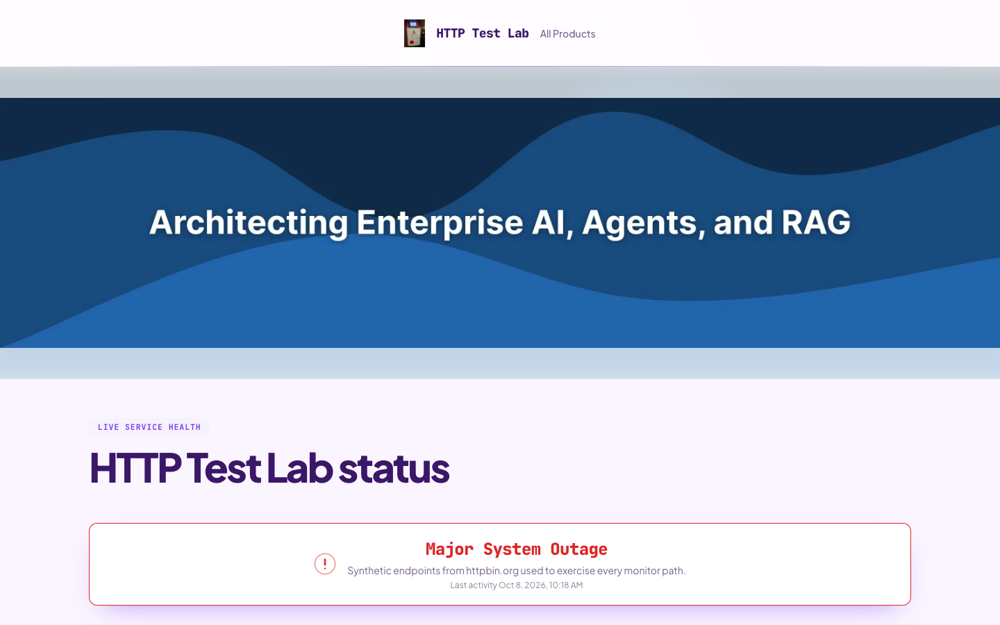

</div>

---

## Why SignalHub

Hosted status-page products charge by the page, the seat and the subscriber, and keep your customer list and incident history on their servers. SignalHub gives you the same workflow on your own infrastructure.

- **You own the data.** Subscribers, incidents, audit history and credentials live in *your* PostgreSQL and *your* storage. No telemetry, no phone-home.
- **No per-subscriber, per-page or per-seat pricing.** The software is free (Apache-2.0). You pay for the server and the email/SMS provider you pick.
- **Enterprise identity included.** SAML, OIDC, SCIM, MFA, role-based access and audience-restricted pages are not locked behind a top tier.
- **Monitoring wired to communication.** A failing check can flip a component, open an incident and notify subscribers automatically.
- **Small to run.** One PostgreSQL database, one web process, one worker. Docker Compose is included.

## 🚀 Quick start

You need Docker with Compose v2. Five minutes, no build tools.

```bash
git clone https://github.com/rameshbgm/signalhub.git && cd signalhub
cp .env.example .env

# generate secrets and paste them into .env
openssl rand -base64 48   # SESSION_SECRET
openssl rand -base64 48   # ENCRYPTION_KEY
openssl rand -base64 24   # POSTGRES_PASSWORD

docker compose up -d --build

# create your first organization and administrator (password via stdin, never in history)
printf '%s' 'a-long-unique-password' | docker compose exec -T web \
  node dist-runtime/bootstrap.mjs --username admin --email you@example.com \
  --org-name "Your Company" --org-slug your-company --password-stdin
```

Open <http://localhost:3301/organization/login>, sign in as `admin`, set a new password, and create your first status page.

> For production add a reverse proxy with TLS, set `NEXT_PUBLIC_APP_URL` to your `https://` URL and configure email. The [setup guide](docs/OPEN_SOURCE_SETUP_GUIDE.md) covers Caddy and nginx, backups and upgrades step by step.

## ✨ Features

### Status pages your customers will actually read

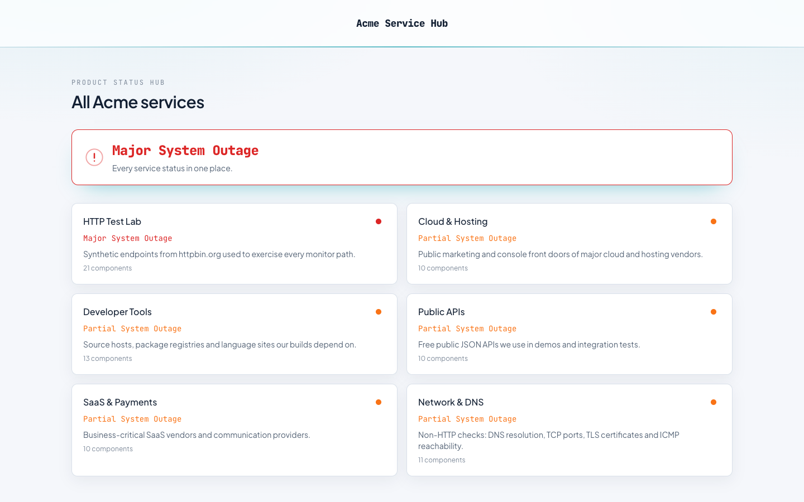

- **Three page types**: public, private (shared password) and **audience** pages for named users and groups, with per-component visibility.
- **Hubs** that combine many pages into one "all our services" view, with access-aware children.
- **Your brand**: 12 theme presets, logo, favicon and cover image with crop, uptime-bar styles, custom CSS (sanitized), header/footer HTML, draft and publish with 30 versions of design history.
- **Components and groups** with five statuses, drag-and-drop ordering, per-component uptime history and optional public **metric charts** (24 h to 90 d; line, area, bar, heatmap, gauge and more).
- **Incident history**, RSS and Atom feeds, an **embeddable banner** and an **SVG status badge** for your docs and README.
- Cookie-free **page analytics** (views, incident views, subscription conversion).

<table>
<tr>
<td width="62%">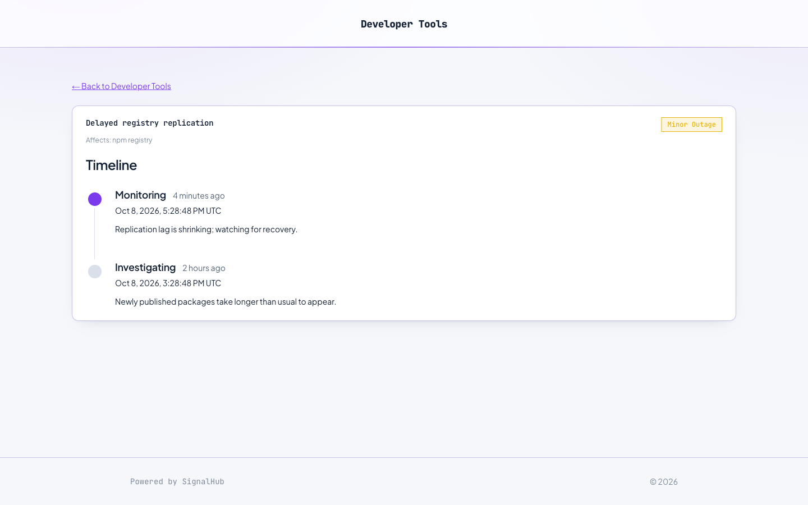</td>
<td width="38%">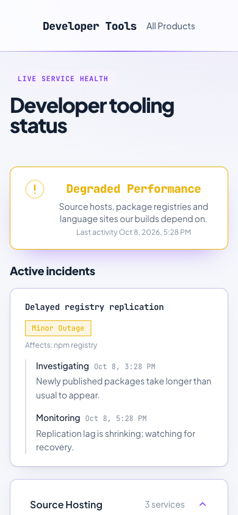</td>
</tr>
<tr>
<td align="center"><sub>Timelines with every update, affected components and impact</sub></td>
<td align="center"><sub>Responsive on any screen</sub></td>
</tr>
</table>

### Incidents and maintenance, without the chaos

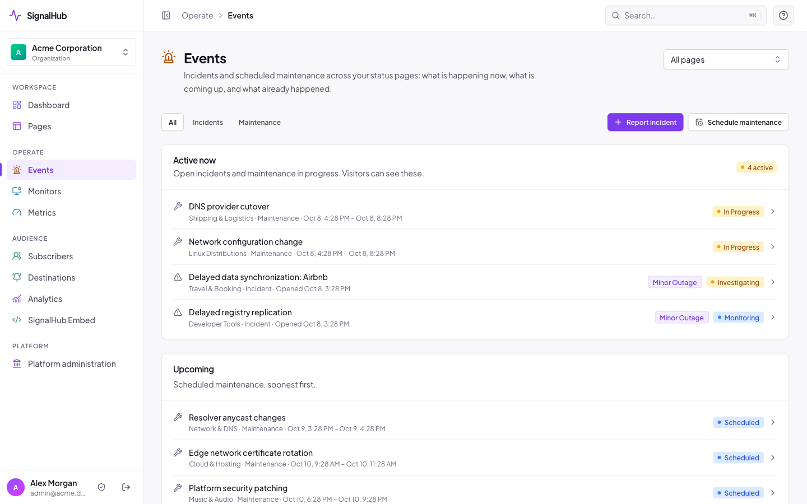

- **Incidents** with Investigating, Identified, Monitoring and Resolved states, impact levels, timeline updates you can edit, affected components and an optional published **postmortem**.
- **Scheduled maintenance** with Scheduled, In progress, Verifying and Completed states, enforced transitions, **auto-transition** and reminder emails before the window.
- One unified **Events** view for what is happening now, what is coming and what already happened.

### Monitoring that updates your page for you

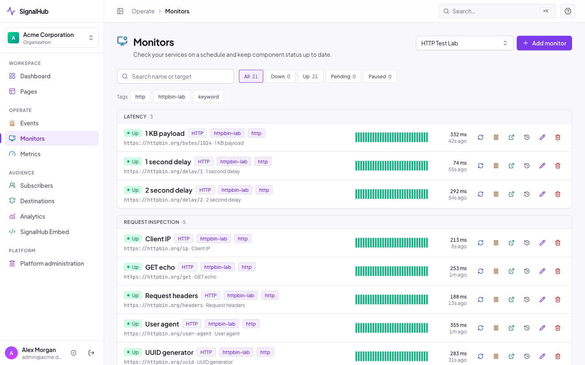

- **Seven monitor types**: HTTP, keyword, TCP, TLS (certificate expiry), DNS, ICMP and **heartbeat** (cron and job monitoring).
- Intervals from **10 seconds to 24 hours**, failure and recovery thresholds, expected status ranges, response keyword match or absence, custom headers and Basic, Bearer or header auth.
- Monitors can **flip component status, record a metric, open an incident and notify**, with only sanitized failure categories shown publicly.
- **SSRF-safe by design**: connect-time address validation (no DNS rebinding), no redirects followed, private ranges blocked by default.
- Check history stored in monthly partitions with automatic retention.

### Reach subscribers where they are

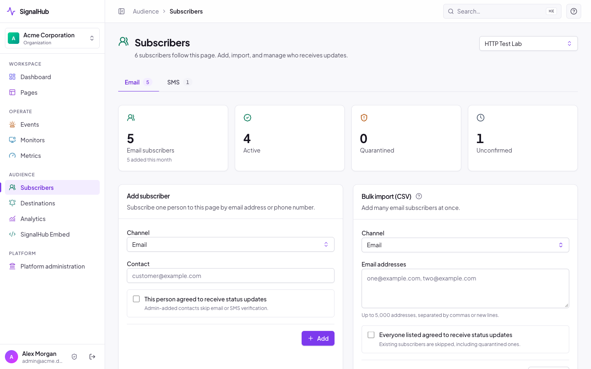

- **Subscribers** by email, SMS or webhook with OTP verification, per-component and per-event filters, one-click unsubscribe (RFC 8058), preference pages, bounce quarantine, and CSV import (up to 5,000) and export.
- **21 email provider presets** (Amazon SES, Mailgun, Postmark, Resend, SendGrid, Microsoft 365, Gmail and more) or any SMTP server.
- **8 SMS providers**: Twilio, Vonage, Plivo, Telnyx, Sinch, ClickSend, Textmagic, Africa's Talking.
- **23 team destinations**: Slack, Teams, Discord, Google Chat, Mattermost, Telegram, PagerDuty, Opsgenie, ntfy, generic HTTP and more.
- **Signed webhooks** (HMAC-SHA256) with retries, dead-letter visibility and secret rotation.

### Run it like a platform

<table>
<tr>
<td width="50%">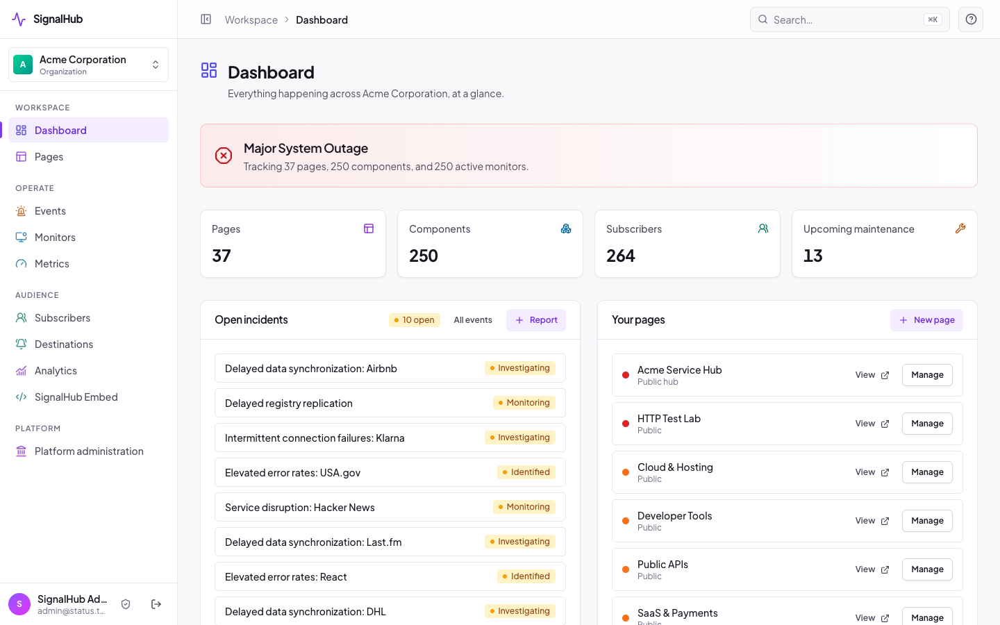</td>
<td width="50%">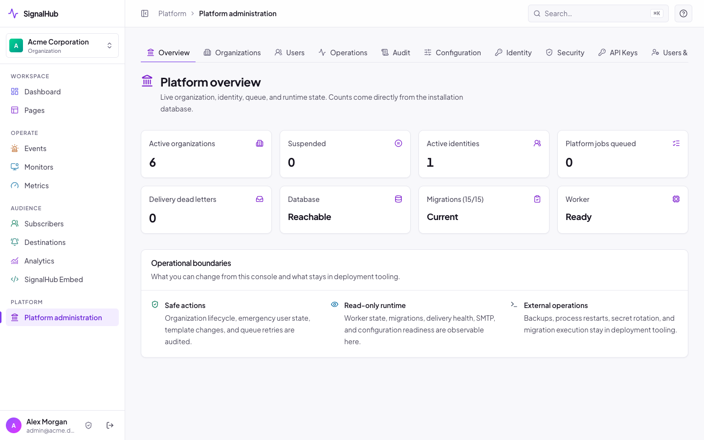</td>
</tr>
<tr>
<td align="center"><sub>Organization dashboard</sub></td>
<td align="center"><sub>Platform console: orgs, identity, queues, health</sub></td>
</tr>
</table>

- **Multi-tenant**: many organizations on one install, users can belong to several; a separate installation-level administrator (optionally IP-restricted).
- **RBAC**: Admin, Incident Manager, Responder and Viewer roles over ten capabilities, optionally limited to selected pages.
- **Identity**: local accounts with Argon2id and TOTP MFA, **OIDC**, **SAML 2.0** and **SCIM 2.0** provisioning with group-to-role mapping.
- **Tamper-evident audit log**: hash-chained and sealed, exportable (CSV/JSON), with signed **SIEM delivery** and a CLI verifier.
- **Data controls**: retention per organization, one-click organization export, organization purge.

<table>
<tr>
<td width="50%">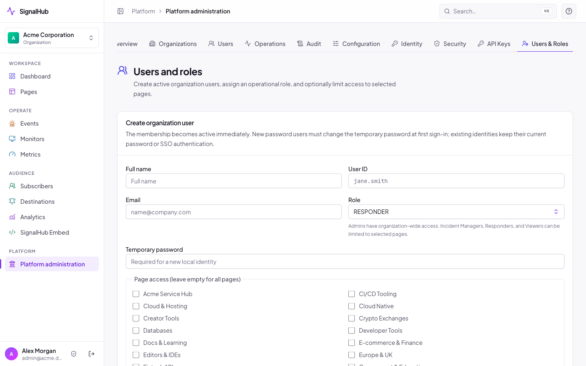</td>
<td width="50%">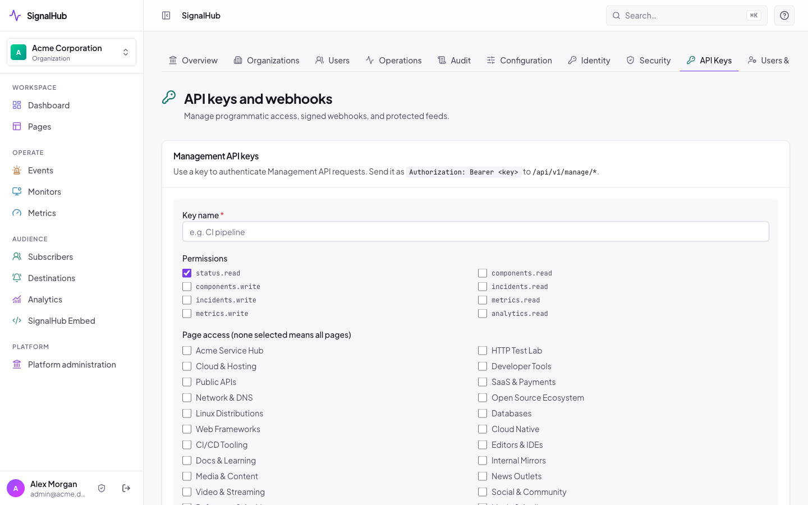</td>
</tr>
<tr>
<td align="center"><sub>Users, roles and page-level access</sub></td>
<td align="center"><sub>Scoped API keys and signed webhooks</sub></td>
</tr>
</table>

### Built for operators

- **Health endpoints** (`/api/health/live`, `/api/health/ready`), a Prometheus metrics endpoint, structured JSON logs and OpenTelemetry tracing.
- **`signalhubctl`** CLI: preflight, doctor, migrate, backup and restore, audit verification, org export, encryption-key rotation.
- **Zero-downtime key rotation** with keyrings for both session signing and data encryption.
- Hardened containers: non-root, all capabilities dropped, internal database network, signed multi-arch images with SBOM and provenance.

<details>
<summary><b>More screenshots</b></summary>

<br>

| | |
|---|---|
| 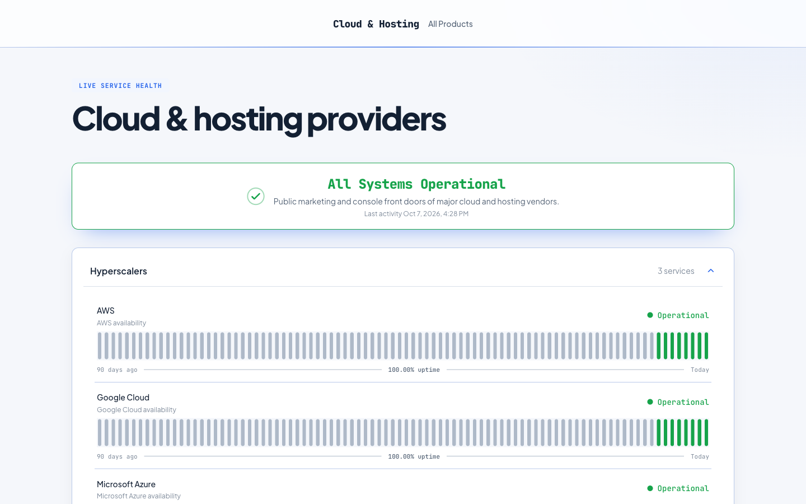<br><sub>A healthy public page</sub> | 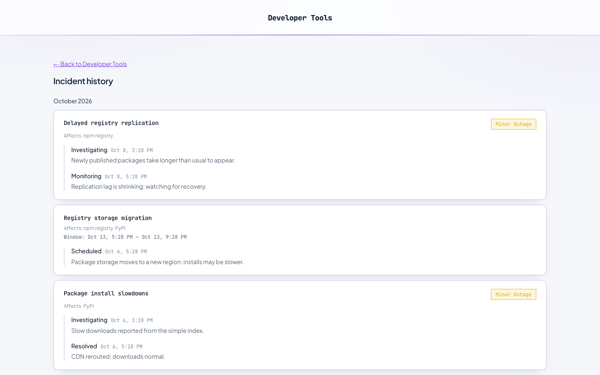<br><sub>Public incident history</sub> |
| 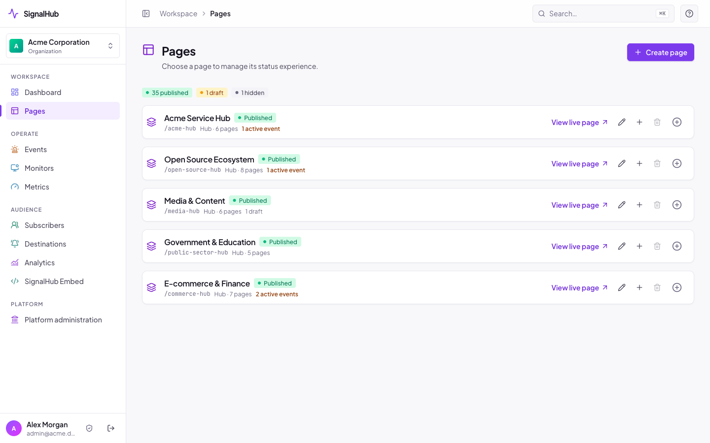<br><sub>Pages and hubs in one list</sub> | 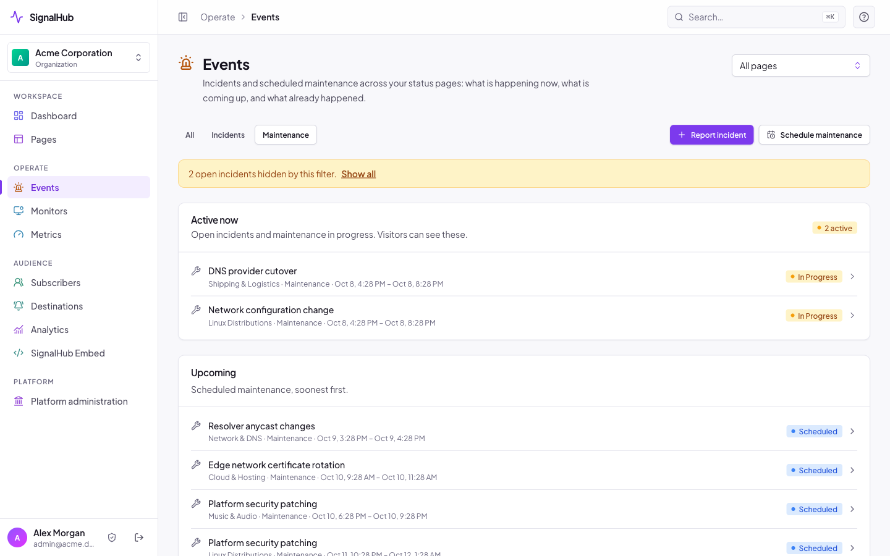<br><sub>Scheduled maintenance</sub> |
| 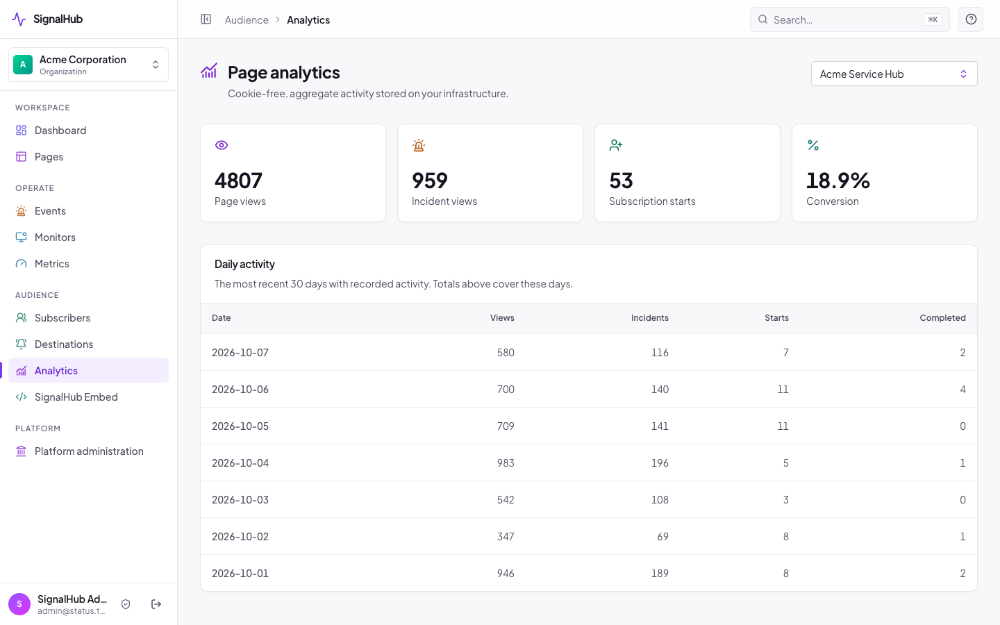<br><sub>Cookie-free page analytics</sub> | 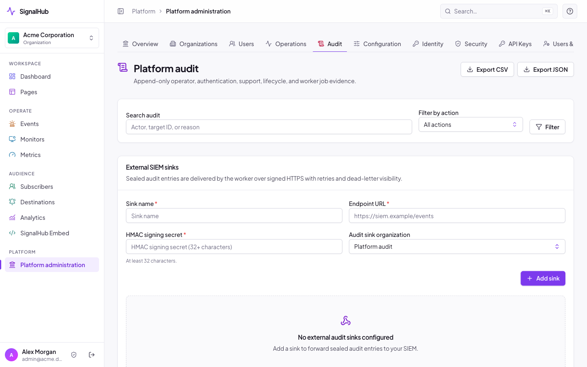<br><sub>Audit log, export and SIEM sinks</sub> |

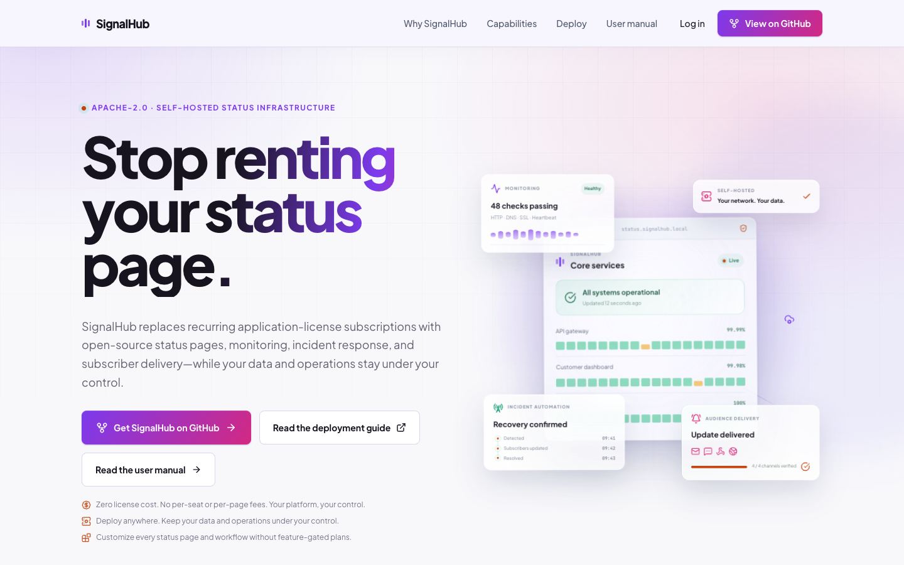

</details>

## 🆚 How it compares

SignalHub is a **self-hosted** platform. Here is how it lines up against the tools people usually evaluate. Full table, sources and caveats: [docs/comparison.md](docs/comparison.md).

| | **SignalHub** | Atlassian Statuspage | Better Stack | Instatus | Uptime Kuma | Gatus |
|---|---|---|---|---|---|---|
| Model | Self-hosted | SaaS | SaaS | SaaS | Self-hosted | Self-hosted |
| License | **Apache-2.0** | Proprietary | Proprietary | Proprietary | MIT | Apache-2.0 |
| Data on your infrastructure | ✅ | ❌ | ❌ | ❌ | ✅ | ✅ |
| Built-in monitoring | ✅ 7 types | ❌ | ✅ | ✅ | ✅ | ✅ |
| Subscribers (email / SMS / webhook) | ✅ | ✅ plan-capped | ✅ add-ons | ✅ plan-capped | ❌ | ❌ |
| Private / audience pages | ✅ | ✅ pricier plans | ✅ add-on | ✅ top tier | n/v | n/v |
| SAML, OIDC, SCIM | ✅ | paid tiers | add-on | top tier | n/v | n/v |
| Multi-tenant (many orgs) | ✅ | n/a | n/a | n/a | n/v | n/v |
| Hash-chained audit + SIEM | ✅ | n/v | n/v | n/v | n/v | n/v |
| Per-subscriber pricing | **none** | yes | yes | yes | none | none |

<sub>`n/v` = not verified, no claim made. Competitor details come from public pricing pages and third-party comparisons as of 9 Oct 2026 and change often; verify before you decide. StatusCake and Cachet are covered in the [full comparison](docs/comparison.md).</sub>

### What it costs

| | Software | Typical monthly cost for a **public** page |
|---|---|---|
| **SignalHub** | **$0** (Apache-2.0) | Your server (a small 2 vCPU / 2–4 GB VPS is enough to start) + your email/SMS provider. **Does not grow with subscribers, pages or seats.** |
| Atlassian Statuspage | SaaS | ≈ $29 (250 subscribers) · ≈ $99 (1,000) · ≈ $399 (5,000) · ≈ $1,499 (25,000). Private pages are separate plans. |
| Instatus | SaaS | Free (200 subscribers) · ≈ $20 Pro (5,000) · ≈ $300 Business (25,000, private pages, SAML) |
| Better Stack | SaaS | A la carte: extra pages, subscribers beyond 1,000 and per-page add-ons are billed separately |

<sub>List prices as reported 9 Oct 2026, USD, indicative only. See [sources and caveats](docs/comparison.md#cost).</sub>

### Where another tool is the better choice

Be honest with yourself about the trade-off: you operate SignalHub. If you do not want to run anything, choose a hosted product. If you need probes from many regions out of the box, SignalHub checks from wherever your worker runs (run workers in several places, or push results in through the API). The UI is English only today. And if you just want one personal monitor with a simple page, Uptime Kuma or Gatus are lighter.

## 🔒 Security and data protection

> Self-hosting gives you the controls. SignalHub does not claim GDPR, SOC 2 or ISO certification; compliance remains your organization's responsibility. Details: [docs/security.md](docs/security.md).

| Area | What SignalHub does |
|---|---|
| **Data residency** | Everything is in your PostgreSQL and storage. You choose the region and every provider. No built-in telemetry. |
| **Encryption** | AES-256-GCM for stored credentials, TOTP secrets and **subscriber contacts**, with a versioned keyring and a rotation command. Tokens, API keys, OTPs and recovery codes are stored hashed. |
| **Authentication** | Argon2id passwords, TOTP MFA, OIDC, SAML 2.0, SCIM, login throttling, idle and absolute session timeouts, revocable sessions. |
| **Access control** | Four roles, per-page limits, last-admin protection, separate and IP-restrictable platform administration, scoped API keys with expiry and CIDR allowlists. |
| **Auditability** | Hash-chained audit log, CLI verification, CSV/JSON export, signed delivery to your SIEM. 7-year default retention. |
| **Network safety** | SSRF guards on monitors, webhooks and destinations; database-backed rate limits; CSP, frame, referrer and permissions headers. |
| **Privacy tooling** | Double opt-in subscriptions, one-click unsubscribe, cookie-free analytics, retention policies, per-organization export and purge. |
| **Supply chain** | CI with `npm audit`, signed multi-arch images with SBOM and provenance. |

## 🧱 Architecture

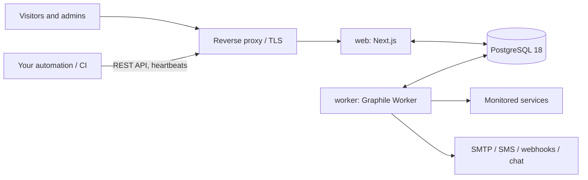
```mermaid
flowchart LR
  U[Visitors and admins] --> P[Reverse proxy / TLS]
  P --> W[web: Next.js]
  W <--> DB[(PostgreSQL 18)]
  WK[worker: Graphile Worker] <--> DB
  WK --> M[Monitored services]
  WK --> N[SMTP / SMS / webhooks / chat]
    A[Your automation / CI] -->|REST API, heartbeats| P
```

- **web** serves public pages, the admin UI, the platform console and `/api/v1`. It never runs background work: it enqueues jobs in its database transaction.
- **worker** runs monitors, delivers notifications, exports and audit events, performs maintenance transitions and retention. Sweeps are lease-based and idempotent, so you can run several workers.
- **PostgreSQL** is the only stateful dependency, including uploaded images and exports. Schema changes ship as numbered plain-SQL migrations.

Stack: Next.js 16 (App Router), React 19, TypeScript, Tailwind CSS 4, PostgreSQL 18 with Kysely, Graphile Worker, Node 22.

## 🔌 REST API

Create scoped API keys in the platform console (`status.read`, `components.read|write`, `incidents.read|write`, `metrics.read|write`, `analytics.read`), optionally restricted to pages, with expiry and IP allowlists. An OpenAPI 3.1 document is served at `/api/openapi`.

```bash
# public: current status of a page
curl https://status.example.com/api/v1/status/your-page

# automation: open an incident from your pipeline
curl -X POST https://status.example.com/api/v1/manage/incidents \
  -H "Authorization: Bearer $SIGNALHUB_API_KEY" \
  -H "Content-Type: application/json" \
  -d '{
        "pageId": "<page-id>",
        "name": "Elevated API latency",
        "status": "INVESTIGATING",
        "impact": "MINOR",
        "body": "We are investigating elevated latency on the public API.",
        "pageWide": true
      }'

# heartbeat monitor: ping from a cron job
curl -fsS https://status.example.com/api/v1/heartbeat/<token>
```

There is also an inbound **component webhook** per component for tools that can only POST a status, an embeddable banner at `/api/v1/embed/<slug>` and an SVG badge at `/api/v1/badge/<slug>`.

## 🧰 CLI

```bash
docker compose exec web node dist-runtime/signalhubctl.mjs <command>
```

| Command | What it does |
|---|---|
| `preflight` / `doctor` | Validate configuration and runtime health |
| `migrate [--check]` | Apply or verify database migrations |
| `backup` / `restore` | Checksummed PostgreSQL backup and guarded restore |
| `audit [--seal]` | Verify the tamper-evident audit chain |
| `export --org <id>` | Queue a full organization data export |
| `rotate-encryption-key` | Re-encrypt stored secrets with the active key |

## 📚 Documentation

| Guide | Covers |
|---|---|
| [Setup and deployment](docs/OPEN_SOURCE_SETUP_GUIDE.md) | Docker Compose, first admin, TLS with Caddy/nginx, email/SMS, prebuilt image, upgrades, troubleshooting |
| [Configuration reference](docs/configuration.md) | Every environment variable, defaults and when to change them |
| [Security and data protection](docs/security.md) | Encryption, identity, audit, hardening checklist, privacy tooling |
| [Operations](docs/operations.md) | Health and metrics, backup and restore drills, key rotation, retention, scaling |
| [Comparison](docs/comparison.md) | Detailed comparison with sources and caveats |
| [User manual](public/docs/user-manual.html) | Operator manual served with the app |
| [Contributing](CONTRIBUTING.md) | Dev setup, project layout, tests, conventions |

## 💻 Local development

```bash
npm install
cp .env.example .env                 # fill SESSION_SECRET, ENCRYPTION_KEY, DATABASE_URL
npm run db:migrate
printf '%s' 'a-long-dev-password' | npm run bootstrap -- --password-stdin
npm run dev:all                      # web on :3301 + worker
```

| Command | Purpose |
|---|---|
| `npm run verify` | Lint (zero warnings), typecheck, unit tests and build. Run before committing |
| `npm test` | Vitest unit tests |
| `npm run test:integration` | Database tests (needs `INTEGRATION_DATABASE_URL`, name must contain `test`) |
| `npm run test:e2e` | Playwright end-to-end tests |
| `npm run build` | Build web, then bundle worker and CLI into `dist-runtime/` |

## 🗺️ Roadmap

Shipped today is everything above. These are **ideas, not commitments**; nothing below is implemented yet:

- Custom domains for status pages
- Optional, bring-your-own-model AI assistance (draft incident updates, explain failures). Plans are in `docs/superpowers/plans/`
- Page content translation
- More management API endpoints (monitors, subscribers, maintenance) and a complete OpenAPI description
- Multi-region probe workers

Have a use case? [Open an issue](https://github.com/rameshbgm/signalhub/issues) and tell us.

## 🤝 Contributing

Contributions of every size are welcome: bug reports, docs, tests, features. Read [CONTRIBUTING.md](CONTRIBUTING.md), run `npm run verify`, and open a pull request. Report vulnerabilities privately as described in [SECURITY.md](SECURITY.md).

If SignalHub saves you money or sleep, a ⭐ on GitHub helps others find it.

## 📄 License

[Apache License 2.0](LICENSE). Use it, modify it, run it commercially.

<div align="center"><sub>Built for teams who would rather own their status page than rent it.</sub></div>
